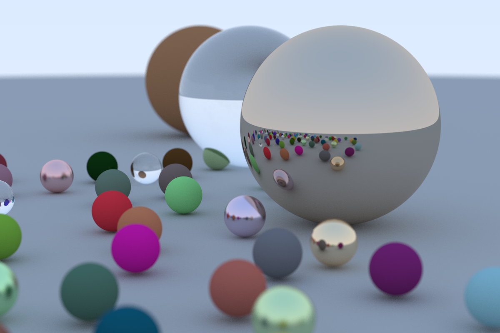
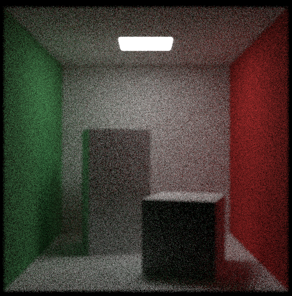
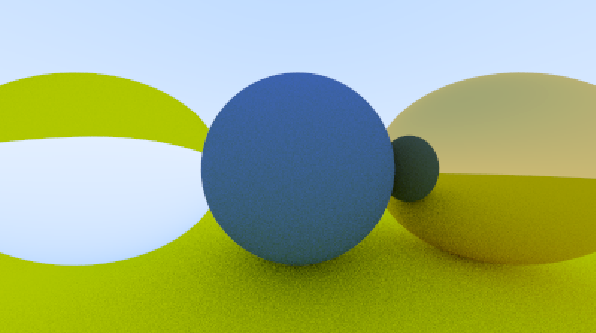
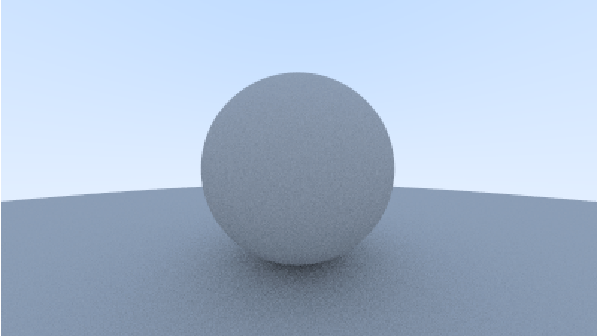
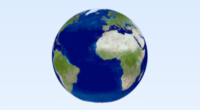
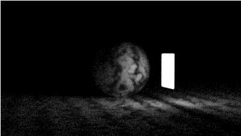
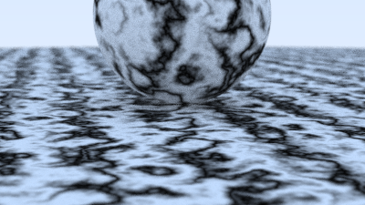
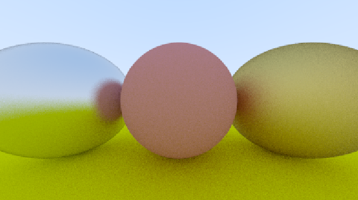
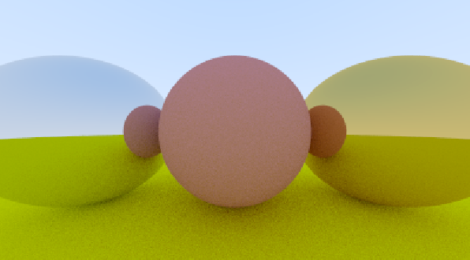

# Eye-Renderer
An offline ray tracing project I'm doing to get familiarized with different ray-tracing techniques. The project is implemented in CMake with C++.

The project is based on [this](https://raytracing.github.io/) series.

Currently, it features the simplest ways to fire a ray from a camera to the world. The world is made up of spheres, so the linear algebra isn't too difficult.
The technique used here is known as path-tracing, as we trace the path the ray took from the camera, and as it bounces around.

As I have time I will update this renderer. Things on the line include:
* Real-time rendering (not guranteed 60 FPS)
* Bounding Hiearchy Volume
* Mulithreading the rendering (and not OpenMP)
* and more stuff as I learn from the series!

Here is the sample output at 50 ray-trace bounces.

## Build
Use CMake to generate project. It should work out of the box with compilers that support OpenMP. This was compiled with MSVC compiler. OpenMP is used to multithread the rendering.

## Images

Here are some nice images for you to enjoy from the project. Although most of them are rendered in low quality so there are bunch of noise

